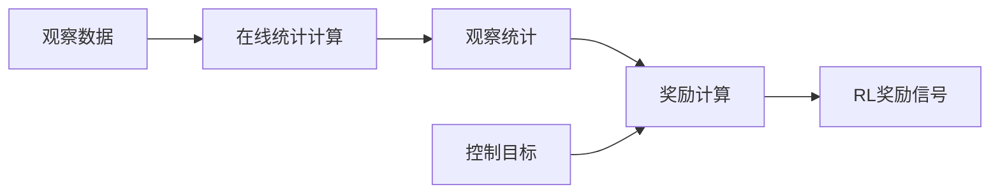

# 基于统计的强化学习控制

[](https://docs.isaacsim.omniverse.nvidia.com/4.5.0/index.html)

## 项目背景
本系统实现了从倒立摆静态平衡到动态周期性运动的控制演进，通过实时统计量（均值/方差）作为奖励信号，为机器人运动控制提供可扩展的强化学习框架。核心创新在于：
- 将传统平衡控制扩展为动态运动控制
- 利用观察统计作为控制稳定性指标
- 可无缝迁移至多关节机器人控制
   - [人形控制开源进行中](https://github.com/zengliangjun/HUMANOID)
   - [人形控制视频](https://www.bilibili.com/video/BV1rQK8zQEo2/?vd_source=2a13aee779bc6301268e18d749a04db4)

## 控制目标演进
1. **静态平衡阶段**：
   - 目标：保持杆子垂直（θ=0）
   - 奖励：`exp(-θ²/0.1)`

2. **动态运动控制阶段**：
   - 目标：实现周期性摆动运动
   - 统计奖励：
     ```math
     r = \underbrace{\exp(-(\mu-\tau_\mu)^2/s_\mu)}_{\text{均值控制}} + \underbrace{\exp(-(\sigma-\tau_\sigma)^2/s_\sigma)}_{\text{幅度调节}}
     ```

3. **机器人控制扩展**：
   - 摆动运动 → 步态生成
   - 单关节控制 → 多关节协同

## 技术实现

### 一、统计计算模块
#### 1.1 核心算法（Welford在线统计）
```python
# joints.py 关键实现
def _calculate_episode(self, diff: torch.Tensor):
    # diff: 当前时间步的关节观测值
    n = self._episode_length()  # 当前episode步数

    # 均值更新
    delta = diff - self.episode_mean_buf
    self.episode_mean_buf += delta / n[:,None]

    # 方差更新（无偏估计）
    delta2 = diff - self.episode_mean_buf
    self.episode_variance_buf = (
        self.episode_variance_buf * (n[:,None]-2)
        + delta * delta2
    ) / (n[:,None]-1)
```

数学表示：
```
μₙ = μₙ₋₁ + (xₙ - μₙ₋₁)/n
σ²ₙ = [(n-2)σ²ₙ₋₁ + (xₙ - μₙ₋₁)(xₙ - μₙ)]/(n-1)
```

### 二、奖励计算模块
#### 2.1 典型奖励函数
```python
# statistic_joints.py 示例
def rew_car_swing(env, cfg):
    # 获取统计量（标准差）
    stats = env.statistics_manager.get_term(cfg.statistics_name)
    swing = torch.sqrt(stats.episode_variance_buf[:, joint_id])

    # 获取目标值
    target = env.command_manager.get_command(cfg.command_name)[:, 1]

    # 计算奖励
    return torch.exp(-(swing - target)**2 * 4 / target)
```

数学形式：
```
r = exp(-(σ - τ)²/s)
```
- σ：实际统计量（标准差）
- τ：目标值
- s：缩放系数（示例中为target/4）

### 三、系统工作流程


### 四、关键参数说明
| 参数 | 来源 | 示例值 | 说明 |
|------|------|--------|------|
| μ | 均值统计 | 0.12 | 关节位置滑动均值 |
| σ² | 方差统计 | 0.05 | 关节运动波动程度 |
| τ | 命令管理器 | 0.5 | 期望摆动幅度 |
| s | 奖励配置 | 0.125 | 控制奖励衰减速度 |


### 五、环境及运行

1） IsaacSim 安装 [here](https://isaac-sim.github.io/IsaacLab/main/source/setup/installation/binaries_installation.html#installing-isaac-sim)

2） IsaacLab 安装 [here](https://isaac-sim.github.io/IsaacLab/main/source/setup/installation/binaries_installation.html#installing-isaac-lab)


训练
```bash
python scripts/rsl_rl/train.py --task Cartpole-Swing --headless
```

运行
```bash
python scripts/rsl_rl/play.py --task Cartpole-Swing-PLAY
```

# Citation
Please use the following bibtex if you find this repo helpful and would like to cite:

```bibtex
@misc{CARTPOLE,
  author = {liangjun},
  title = {基于统计的强化学习控制},
  year = {2025},
  publisher = {GitHub},
  journal = {GitHub repository},
  howpublished = {\url{https://github.com/zengliangjun/HumanoidVerse2}},
}
```
